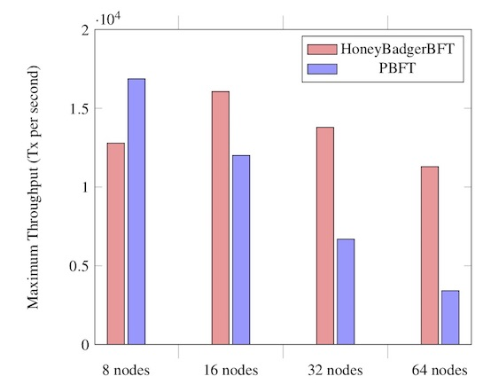

# Table of Contents
<!-- TOC depthFrom:1 depthTo:6 withLinks:1 updateOnSave:0 orderedList:0 -->

 * [1. Problems to be solved](#1-problems-to-be-solved)
	* [1.1. Speed](#11-speed)
	* [1.2. Security](#12-security)
	* [1.3. Decentralization and openness](#13-decentralization-and-openness)
	* [1.4. ROMAD DLT requirements](#14-romad-dlt-requirements)
* [2. DLT types](#2-dlt-types)
* [3. Consensuses](#3-consensuses)
	* [3.1. Consensus protocols families](#31-consensus-protocols-families)
	* [3.2. BFT/PBFT/ABFT/RBFT/DBFT algorithms comparison](#32-bftpbftabftrbftdbft-algorithms-comparison)
	* [3.3. BFT Issues and Solutions](#33-bft-issues-and-solutions)
	* [3.4. Conclusions](#34-conclusions)
* [4. Model](#4-model)
	* [4.1. Delegates](#41-delegates)
	* [4.2. Reputation](#42-reputation)
	* [4.3. Consensus](#43-consensus)
* [Questions & Answers](#questions-answers)
	* [1. Is it possible that 2/3 of the delegates are malicious?](#1-is-it-possible-that-23-of-the-delegates-are-malicious)
	* [2. Anything else?](#2-anything-else)
	* [3. How do you plan to protect against Nothing-at-Stake?](#3-how-do-you-plan-to-protect-against-nothing-at-stake)
* [References](#references)

<!-- /TOC -->

These are the preliminatry design notes and considerations for ROMAD blockchain.

# 1. Problems to be solved
There are 3 main problems [1] for the distributed ledger technology (DLT) developers:
- to ensure the ledger speed and scalability;
- to ensue the ledger security;
- to make the ledger as decentralized as possible in terms of the functioning and control.

## 1.1. Speed
The transactions speed (measured in transactions per second or tx/s) is the main DLT problem. Why this is important:
1. Micro transactions. There will be many of them and they need to be done fast.
2. The DLT-based payment system with the many users. Visa claimed in 2011 of being able to achieve 24К tx/s [2]. This value is the de facto bandwith golden standard for the payment systems since then. For example:
 - Ripple is able to achieve 1500 tx/s [3].
 - IOTA. When operating at 1000 tx/s IOTA requires 1.6Mb/s of its nodes' bandwith. ***The IOTA live journal shows ~14.0 tx/s at the time of writing*** [4].

The researchers are operating with the following DLT speed charateristics:
 1. The transactions per second ratio. This is by no means is an exhaustive value. It is possible for the ledger to suspend the transactions for an hour, then it processes 1M of them and the average value will be 277 tx/s.
 2. The transaction latency. There is a time when the transaction is issued and a time when the transaction is initially confirmed. The time difference between these two events is the latency. This tends to be a more objective measurement metric, however it is not exhaustive as well.
 3. The finality is when the transaction is closed, i.e. there are no means to cancel or rollback it. In fact one can only trust the transfer performed by, e.g. a smart-contract, when the transaction is finalized.

The most balanced opinion about the DLT speed charateristics is in the article of Andrei Grigorean at Hackernoon [5]:
 1. "For small payments, merchants would probably accept a payment the moment the transaction is initially confirmed, provided that they have a reasonably high confidence the payment will be accepted eventually."
 2. However: "for large money transfers, the receiver of the funds would probably want to wait for the transaction to become irreversible. Or at least, enough time should pass until a probabilistic finality is reached."
 3. And here we see one of the biggest DLT problems: "...In the financial industry, institutions need to know, preferably as quickly as possible, whether they truly own certain assets. If a public distributed ledger technology (DLT) is used to store the ownership information, the institutions also need to be sure it will not be possible to revert a certain transaction, making them lose the ownership rights..."

## 1.2. Security
The DLT security actually assumes the system is able to function correctly when some nodes are performing incorrectly. The incorrectness can be a consequence of:
- the hardware or software errors, i.e the node is faulty;
- the malicious intents, i.e. the node behaves maliciously;
- the load factor, i.e. the node is overloaded either because of the software design mistakes or the malicious intents;
- the DLT network segmentation, i.e. some nodes cannot see the other ones.

The correctness of the DLT functioning is the subject of the numerous debates and researches. ROMAD uses the defenitions from [6] "it suffices to build a totally globally-consistent, totally- ordered, append-only transaction log"
There are the following consequences from the definition:
- it prevents the double-spend attack;
- it prevents the transactions re-ordering;
- it prevents the ability of the certain nodes to lie about the transactions;

## 1.3. Decentralization and openness
Decentralization is the DLT ability that assumes the decision is made by the majority of the nodes in the network. Ideally all the nodes should vote. This allows for DLT to function without the need to trust to the individual nodes. Instead the DLT trusts to the majority only.

The analytics is presented mainly in [7] - [10].

|          | Public                                                      | Private/Federated              |
| -------- | ----------------------------------------------------------- | ------------------------------ |
| Access   | Open read/write                                             | Permissioned read and/or write |
| Speed    | Slower                                                      | Faster                         |
| Security | Proof of Work / Proof of Stake / Other consensus Mechanisms | Pre-approved participants      |
| Identity | Anonymous / Pseudonymous                                    | Know identities                |
| Asset    | Native Asset                                                | Any Asset                      |

These are the edge cases. In general it is hard to distinguish between Public/Private and Permissioned/Permissionless. There are private ledgers that use the consensus and there are public ledgers (e.g. NEO) that use the pre-approved supernodes for the consensus.

## 1.4. ROMAD DLT requirements

  1. **The more tx/s, the better. Low latency.** tx/s is important in the commercial applications. We believe our transactions are not going to transfer the significant amount of tokens in the near future so that the latency is not that important. However, we want to keep it as low as possible.
  2. ROMAD DLT is **resilent to the bad nodes**. These include the malicious ones as well.
  3. **Bit rate on writes**. ROMAD's ledger is to contain the malware data on the Stage I, so the write speed is very important.
  4. **Disk space**. The less, the better.
  5. ROMAD's ledger is the **public and open** one.

# 2. DLT types
As shown in [11], the Distributed Ledger was introduced in late 1990th and was based on the Mutual distributed ledger (MDL) data structure. In fact the same transaction was stored in multiple databases. DL has raised significant attention in 2008 as the cryptocurrencies foundation. The first public DLs were based on the blockchain structure. As the field became more matured, the alternatives were proposed. DAG (Directed Acyclic Graph) was introduced in 2016-2017. Tempo Ledger was introduced in 2018. To sum it up:
- Blockchain;
- DAG;
- Tempo Ledger.

Blockchain-based DLT properties are:
1. The ordered linked list that consists of the blocks. Merkle tree.
2. The block size problem
3. There are orphaned blocks [26]

DAG-based DLT properties are:
1. The directed acyclic graph is at the foundation. The verticies are the transactions, the edges are connections between the transactions.
2. Fast initial confirmation [27], [28].
3. Better scalability, no block size problem [29].
4. No orphaned blocks
5. No delays when sending the transactions to the network.
6. Transactions finality (Some DLTs do not have it, like IOTA)

Some comparisons are present in [11]:

Tempo Ledger is currently not very well studied, so ROMAD is not going to use it. ROMAD blockchain is based on DAG, as it is the fastest and most compact data structure currently proposed for DL implementation.

# 3. Consensuses
## 3.1. Consensus protocols families
There are many known consensus protocols that can be used in DLT implementation [11].

One of the possible classifications goes below.

* Proof based consensus – a single node that uses some valuable resource to ‘justify’ the decision made in fact makes the decision. If the decision does not correspond to the rules, it is ignored and the resource is wasted.  The computation capacity is used for the Proof-of-Work. The computation time is used for the Proof-of-Elapsed Time. The deposits are used for deposit-based consensuses.  Such systems have various checks to prove that the resource was spent.
* Despite the common belief, we believe the Proof-of-Reputation, the Proof-of-Importance and the Proof-of-Stake (without deposit) to be a separate group of protocols – due to the flow in such cases is usually based not on the resource spent but on the psychological factor instead. The nodes owners do not benefit from making incorrect decisions, because it will lead to the system errors and will indirectly influence their status.
* Consensus protocol - the decisions are made in a coordinated manner by several nodes taking into consideration that some nodes might be malicious or work incorrectly.
* Consensus protocol + PoW/PoET or PoR/PoI mixture. There are the tasks (e.g. choosing a voting committee, setting an offer, dealing with the protocol’s stagnation, etc) that still need a leader.  However the decision is still made in a coordinated manner.

We believe **the consensus protocols or a mixture of the consensus protocols + PoR/PoI** suites us most. The consensus protocols are based on the state machine replication in the distributed environment (Leslie Lamport [12], [13] and Fred Schneider [14]). It is true that in order for two or more nodes to come to a common decision they should possess the same input date necessary for the decision making, to be in the same state, and have the same state changing rules. All the consensus protocol’s variations are aimed at ensuring the replication with the minimum necessary information transferred.

The Proof-of-Work and Proof-of-Elapsed Time type protocols put a great load on the clients’ nodes. This is highly undesirable in case of the low capacity equipment.
It is not advisable to use the leader-based protocol for the public ledger – it presupposes the individual trust to the leader. This is something to be avoided.

Here is a list of some consensus protocols [6]:
1. Paxos is a family of protocols for solving consensus in a network of untrusted nodes [15].  It is possible the data transfer between the nodes can be corrupted. The protocol includes the clients (those willing to get the consensus decision), voters, a proposer (more commonly known as a speaker) and a leader who is a proposer making when the consensus progress in a dispute.
2. Raft is a family of protocols designed as an alternative to Paxos [16]. Paxos implementation and verification are extremely difficult. Raft is easier to understand and implement. There are lots of implementations and visualisations with comprehensible specs in Go, C++, Java, and Scala.
4. BFT – there are many BFT modifications. They are:
   * classic PBFT [18];
   * Zyzzyva [19];
   * Aardvark [20];
   * Plenum (which is an upgraded RBFT and is used in Sovrin ledger and, thus, in Hyperledger as well [21]);
   * Delegated Byzantine Fault Tolerance [22].
5. Federated Byzantine Agreement (FBA) [17].
6. HoneyBadgerBFT (Hofburg Palace Vienna, Austria / October 24-28, 2016) - asynchronous BFT with the enhanced cryptography [6].
7. Hashgraph Virtual-Voting - asynchronous BFT, not PBFT [23].

The following table depicts the platforms’ description working on the above-mentioned consensus protocol families:

| Algorithm type           | Platform                               |
| ------------------------ | -------------------------------------- |
| Paxos                    | None                                   |
| RAFT                     | Kadena [https://github.com/kadena-io/] |
| PBFT                     | Hyperledger, Stellar, Ripple, Zilliqa  |
| RBFT (PBFT modification) | Sovrin, Hyperledger                    |
| dBFT (PBFT modification) | NEO                                    |

## 3.2. BFT/PBFT/ABFT/RBFT/DBFT algorithms comparison

In fact, there are only two comprehensive comparisons of the PBFT protocols [24] and [25]. It is a problem as there is no significantly important number of the objective reviews. The algorithms need to be studied more. The research [24] offers the review based on the experimental comparison of the various algorithms’ implementation using the BFT-Bench framework. Even though the experimental comparison does not provide fully reliable information (the implementation process might have allowed for some mistakes), we are utilizing it as it is one of few sources providing the comparative time estimates.

The picture displays the reviews/estimates for 4 nodes.

RBFT and Aadvark are showing the best performance when there is a continuous message delay.

RBFT and Aadvark are still showing the best performance when flooding.

Aliph and PBFT are winners, however the performance when there are anomalies is better when compared to the normal conditions. This is weird.

The research [25] compares PBFT, Chain, RPFT, Aardvark, Aliph, Zyzzyva (only the fault-free version) having 4 nodes, 1 node can be faulty. The research shows the following results:

Zyzzyva obviously provided the best speed results (it makes sense as its algorithm is optimised for speed). Aardvark shows better results in terms of stability. Newer algorithms have not been compared.

The consolidated performance table for the different cases:

| Normal conditions  | Single replica crash           | Continuous delays and flood  | Delays and flood (5 clients)          | Overload (10 clients)       |
| ------------------ | ------------------------------ | ---------------------------- | ------------------------------------- | --------------------------- |
| Aliph              | PBFT, Aliph                    | RBFT                         | RBFT                                  | RBFT                        |
| Zyzzyva            | -                              | -                            | PBFT (unstable)                       | -                           |
| PBFT               | -                              | Aardvark                     | -                                     | Aardvark                    |
| RBFT               | -                              | -                            | -                                     | -                           |
| Aardvark           | Zyzzyva, RBFT, Aardvark, Chain | Zyzzyva, PBFT, Aliph, Chain  | Zyzzyva, Aliph, Chain                 | RBFT, Zyzzyva, Aliph, Chain |

The Honey Badger of BFT Protocols - is a new protocol that is not PBFT, but is pretty close to it. There is no objective review on it. The protocol spec states the following:
"Most fault tolerant protocols (including RAFT, PBFT, Zyzzyva, Q/U) don't guarantee good performance when there are Byzantine faults." Well, we have just seen it. The statement seems correct.
"Even the so-called "robust" BFT protocols (like UpRight, RBFT, Prime, Spinning, and Stellar) have various hard-coded timeout parameters, and can only guarantee performance when the network behaves approximately as expected - hence they are best suited to well-controlled settings like corporate data centers."

"HoneyBadger nodes can even stay hidden behind anonymizing relays like Tor, and the purely-asynchronous protocol will make progress at whatever rate the network supports."

The authors provide the following charts:

Latency vs throughput for experiments running HoneyBadgerBFT over Tor.

120 tx/s when working via Tor with the majority of the faulty nodes.

When there are more than 16 nodes, HoneyBadgerBFT provides the higher throughput than PBFT. When there are 64 nodes, the HoneyBadgerBFT's speed is 4-4.5 times better than PBFT's.

## 3.3. BFT Issues and Solutions

1. Problem statement: the classic model works well in the small size groups, as it requires lots of messages to exchange.
   Solutions:
    * Sharding - the consensus group is divided into s smaller sub-groups. The diversity is still presents. There is plenty of the nodes to select from.
    * The selection criteria can be PoR-based for the consensus group. The consensus nodes are selected based on their reputation.

2. Problem statement: MACs (Method Authentication Codes) usage.
   Solutions:
    * Digital signatures, multisignatures or threshold signatures

3. Problem statement: the resilience to the Sybil attacks is unknown.
   Solutions:
    * Use PoR with the penalties (see below) for the consensus nodes.

4. Problem statement: DDoS.
   Solutions:
    * RBFT is immune to DDoS (see the charts above). HoneyBadgerBFT **seems** to be immune as well. Needs to be proved.

### 3.4. Conclusions

1. Purely speculative the Hashgraph Virtual-Voting should give the best speed. However it is **patented** in USPTO 9,529,923 [30]: "Because a distributed database system 100 is used, no leader is appointed among the compute devices … Specifically, none of the compute devices … are identified and/or selected as a leader to settle disputes between values stored in the distributed database instances … of the compute devices . Instead, using the event synchronization processes, the voting processes and/or methods described herein, the compute devices … can collectively converge on a value for a parameter.".
2. RBFT (or Plenum) may theoretically be used. Not the best peak performance, however looks solid. However the replica crashes are very often (up to 1/3 from the total quantity of the consensus nodes). PoR may actucally save us here. We will be disabling the crashing nodes. Plenum is implemented in Hyperleger Indy (https://github.com/hyperledger/indy-plenum/wiki).
3. HoneyBadgerBFT - some academia publications. The interesting idea and the fault tolerance are big pluses. The sources are available. No public reviews.

The ROMAD consensus is going to be based on BFT (more precisely dBFT). Some ideas from the HoneyBadgerBFT shall be taken as well.

# 4. Model
The following design principals will be used in ROMAD Ledger:
1. BlockDAG - Directed Acyclic Graph whose vertices represent blocks of transations and whose edges represent references from blocks to their predecessors. **Motivation:** the transactions can be done in parallel. It means better tx/s rate.
2. Sharding. **Motivation:** the sharding reduces the consensus time. Transactions finality becomes lower.
3. Voting is based on the Proof-of-Reputation + penalties. The voting PoR nodes have the certain hardware requirements (see below). **Motivation:** faulty or malicious nodes will get penalized quickly. The Sybil attack possibility is low.
4. Consensus type: dBFT.
4. Digital signatures. ECC-Shnorr (like in Zilliqa) or some ECDSA threshold option.

ROMAD will use Delegated Byzantine Fault Tolerant (dBFT) consensus model similar to NEO or Tendermint. This is a distributed system which is peer-to-peer based. All messages are broadcasted.

The ROMAD model has the following node types:
1. Ordinary Nodes - the ROMAD Endpoint Defense owners. They can create the transactions.
2. Delegates - they check each and every block. The reward is given for the block check in a manner similar to that from Dash [33]. The requirements are:
 * the HDD space for the ROMAD blockchain (>100 GB);
 * the high bandwidth Internet connection;
 * fast CPU;
 * additional requirements may arise or the current requirements might even be decreased. This is not really important. What is important is that the delegate has no motivation to cheat. If they are unable to meet the requirements, they will never become the speaker and will never get the reward.

The delegates are responsible not only for closing the rounds (see 4.3. Consensus), but also for the data format verification, including the statistical anomalies, e.g. the badly formatted writes on the blockchain from ROMAD Endpoint Defense software clones. Some other examples are the extremely frequent writes from the certain nodes, or the writes that do not contain the valid digital signatures.

***There should not be many delegates***, otherwise the voting process will require the significant time to complete. Initially we plan to have ~100 delegates. This number may go up or down (e.g. NEO has 51 delegate).

dBFT assumes each block is verified by a number of delegates. When the block is being verified:
1. The speaker is selected from the delegates. This is the one that actually makes the calculations. The process is determined. Each delegate must become a speaker for the time slot given. The speaker's reputaton is taken into an account. The better the reputation, the more often this delegate becomes a speaker.
2. The other delegates are the verifiers. For the block to get verified, it needs to contain at least n-f signatures, where f = floor( (n-1)/3) ), where n is the number of the verifiers.

## 4.1. Delegates
To become a delegate one needs to have a collateral. Once the collateral is transferred and locked, the node may start functioning as a delegate or a speaker. The registration is the special transaction. Remember the transactions are broadcasted, the other nodes shall get it fast enough.

## 4.2. Reputation
**The Nothing-at-Stake problem is when verifiers can do a mess if there is no penalty for their actions.** The mess example is, e.g. an invalid transaction confirmation or different attacks on the blockchain (e.g. Short Range, Long Range, etc). The common solution for the Nothing-at-Stake problem is the collateral [2]. It means the certain amount of money is frozen on the verifier's account until it is proved the transaction does not create any conflicts to the blockchain.

ROMAD team goes further. The collateral can be taken out from the node owner when the node reputation is flawed. The following algorithm is used to compute the reputation:

1. Initially each delegate gets a fixed reputation value: ρ = 0.5 (see below).

2. All reputation values are initially the same.  We do not plan to use the external reputation (such as the one suggested in [31]).

3. There are two ways to control the reputation:
  - to decrease it when a delegate performs malicious or unexpected actions. This allows us to support the system health by removing the malicious nodes (that are trying to sabotage the consensus process) or cheating nodes (that are trying to get a reward without doing any computations). Please refer to 4.3 Consensus, step 12 for more details on decreasing the reputation.
  - to encourage a node if it works in an expected manner for a continuous time frame. The reputation value determines the delegate's ability to become a speaker. Thus it is profitable for a 3rd party to keep the node up and running due to the system rules. Please refer to 4.3 Consensus for more details on increasing the reputation.

4. The reputation value can be calculated based on the data from the blockchain. Each delegate can calculate the reputation for the others, see 4.3 Consensus, steps 12 & 13.

Warren Buffet once said, "It takes 20 years to build a reputation and five minutes to ruin it". There are mathematical methods for PoR to mimic this behavior. The slowly growing asymptotic function is used to increase ρ and the fast descending asymptotically striving to zero function is used to decrease it. ρ is in (0..1].

The reputation increasing function must have the following properties [31]:
  - slow start and initial growth;
  - fast acceleration in the middle of the life cycle. This is needed to reward the mature nodes;
  - asymptoticity, e.g. an ability to stop growing indefinitely.

The following formula is used: 1/(1 + exp(-s * α)), where s - the number of the consensuses, where the delegates commonly agreed, α = 0.000057.
The reputation decreasing function must be able to lower it down exponentially or even faster. The following formula is used: 1/(β^f) , where f - is the fails number for the given delegate, β = 1.25

The generalized function is thus: ρ  = 1/((1 + exp(-s * α))*(β^f).

The α and β selection criteria:
 - For the just starting delegate s=0, f=0 and ρ = 0.5.
 - The maximum possible value for ρ = 1.
 - Each delegate is predicted to participate in the consensus round once per 3 minutes. If there are no mistakes for a period of a year (s = 175200), the delegate will reach the maximum possible ρ = 1.
 - When ρ < θ = 0.3275, the delegate is excluded from the group.

E.g., 3 mistakes (f=3) for a delegate that has made 175200 successful consensuses will decrease its reputation to ρ = 0.512. This leads to a two times lower ability to become a speaker. Seven mistakes will lead to ρ = 0.2097 and the exclusion from the consensus group.

The table below shows the numerical values for the delegates' generalized function ρ based on the number of the successful consensuses and mistakes made:

|            | f= 0   | f= 1   | f= 3   | f= 5   | f= 7   |
| ---------- | ------ | ------ | ------ | ------ | ------ |
| s=0        | 0.5000 | 0.4000 | 0.2560 | 0.1638 | 0.1049 |
| s=1000     | 0.5142 | 0.4114 | 0.2633 | 0.1685 | 0.1078 |
| s=10000    | 0.6388 | 0.5110 | 0.3270 | 0.2093 | 0.1340 |
| s=80000    | 0.9896 | 0.7917 | 0.5067 | 0.3243 | 0.2075 |
| s=100000   | 0.9967 | 0.7973 | 0.5103 | 0.3266 | 0.2090 |
| s=175200   | 1.0000 | 0.8000 | 0.5120 | 0.3277 | 0.2097 |
| s=500000   | 1.0000 | 0.8000 | 0.5120 | 0.3277 | 0.2097 |
| s=1000000  | 1.0000 | 0.8000 | 0.5120 | 0.3277 | 0.2097 |
| s=10000000 | 1.0000 | 0.8000 | 0.5120 | 0.3277 | 0.2097 |

It is possible to tweak α, β and θ in any manner to adjust for the different consensus rounds periodicity or the punishment rules.

5. The speaker's reward depends on the reputation:
  - The bigger the reputation (ρ), the more often the delegate becomes a speaker.
  - The transaction has a transaction fee.
  - The speaker gets the transaction fee.

**Motivation:** the delegate may try to deceive a consensus in a number of ways. One option is to give a random response message or a most statistically frequent message. However, the variety of cheating options leads to just a couple of outcomes:
  - the delegate has voted against the consensus without doing any computations (on purpose or just by pure chance). The delegate will be punished and its reputation will be decreased.

  - the delegate has voted for the consensus without doing any computations (just supported the majority). Unfortunately, it means the cheater will also get its reputation increase.

The speaker has no options to cheat on the consensus. Once the proposal message is generated, it means the speaker has done the computations required.

The possible attacks are:

1. The delegate does not want to participate as a speaker for the consensus. Thus, it will not get the reward; there is no financial motivation to cheat. The side effect is the slower consensus when the delegates are going to wait for the suggestion from the non-functioning speaker, see 4.3. Consensus, step 11.

2. The delegate wants to be a speaker only. In this scenario, its reputation is going to grow 100 times slower, then for the delegates that obey the consensus rules. The delegate becomes a speaker less and less often, thus it gets a reward less and less often. The side effect is the slower consensus time. However, as the delegate becomes the speaker less and less often, the side effect becomes negligible as the time goes by.

3. The delegate does not participate at all. This is a combination of 1 and 2. No reputation growth, no reward.

4. The delegate has the sole purpose of damaging the ledger [34].  Reputation penalties, collateral loss, exclusion from the consensus group.

## 4.3. Consensus
ROMAD consensus is round based. The round is given to the verifiers to process a single block. The block processing is atomic. When the round is over, the block is either verified or not. When it is verified, it is immediately available to the blockchain.

Consensus algorithm:
1. The nodes are creating the broadcasted transactions. Each transaction may have the optional digital signature.
2. The ordinary nodes do not save them.
3. The delegates are saving them.
4. Each delegate has a full copy of ROMAD blockchain and the certain data from Ethereum blockchain.
5. When there is a certain number of the unverified transactions, each delegate starts the algorithm for the next speaker selection.
6. The speaker generation algorithm state depends on the actual number of the transactions on the blockchain and the delegates' reputations.
7. The delegates are calculating the reputation independently.
8. The delegate who has generated identifier becomes a speaker and forms up a "suggestion".
9. If for any reason the delegate does not form up a "suggestion", the unverified transations number grows up and the "suggestion" flag goes to the different delegate.
10. Remember, the delegates see the same blockchain state in more or less synchronized manner, so everyone knows whose turn is it now to form up a "suggestion".
11. The "suggestion" is signed with a secret key and is broadcasted.

where:
  *	the speaker with the identifier p;
  *	has a reputation r;
  *	signed a block bi, view  = v;
  *	the block contains = block [the transactions hashes];
  *	 - the _block_ is signed with the secret key P_p of the user _p_.

12. Once the message from 11 is broadcasted, the delegates are verifying it with the certain rules (see below).
13. The delegates are sending the message:

where:
  *	Response - Proposal Agree or Proposal Failed
  *	bi - block index
  *	view  = v;
  *	d - the delegate identifier
  *	r - the delegate reputation
  *	 - the _block_ is signed with the secret key P_d of the user _d_.
14. When there is a message Response: Proposal Agree  from (𝑛 - 𝑓) delegates, every delegate understands there is a consensus and the full block is written on the blockchain.
15. Each delegate who voted in the same way as the entire consensus increases the value s: s = s+1. However, for each delegate who made a mistake in voting, f = f+1. As the messages from step 12 and 13 are written on the blockchain, each delegate can compute the s and f values independently. 
16. The next round begins (goto 5) (yeah, goto haters!)

***If there are any violations on 12***, such as:
  * the data block of the transaction is invalid (see 4. Model);
  * the delegate became a speaker out-of-order;
  * the transactions are already on the blockchain;
  * not all contract scripts transactions are completed;
  * double spent is detected;
  * the wrong link to the previous block (the fork attempt);
  * the speaker reputation is not corresponding to the one stated in the message;
  * the speaker reputation is < θ
  * an attack attempt is detected

***the block is considered invalid.*** The delegate that has detected this, does the following:
  * sends the Proposal Failed message.
  * does the ChangeView. It changes the View number so that the new speaker is selected.

When the other verifiers are getting the Proposal Failed message and there are at least (𝑛 - 𝑓) of them, they also send the ChangeView message.
  * Thus the malicious speaker is opted out for the different one;
  * fails number for the given speaker (f) increased;
  * the malicious speaker is penalized ρ  = 1/((1 + exp(-s * α))*(β^f) , where f - is the fails number for the given speaker.
  * the Response messages are stored on the blockchain.

***If there is a timeout on 14*** and there are no (𝑛 - 𝑓) response messages
***then:***
  * Any delegate sends Response = ChangeView message
	* when the other delegates are getting the ChangeView message and there are at least (𝑛 − 𝑓) of them, they also send the ChangeView message.
	* The view_number changes, the speaker is also changed.
	* No penalties for the speaker in this case.

The algorithm ensuers the immediate transactions availability when the consensus round is over.

# Questions & Answers
## 1. Is it possible that 2/3 of the delegates are malicious?

We plan to have ~100 delegates (like Tendermint). It means there must be 66 malicious nodes that correspond to the hardware requirements. This seems unlikely.

Also keep in mind the collateral is required to become a delegate. There is no financial motivation to cheat. And there is a punishment if there is a cheating attempt.

## 2. Anything else?

The delegate must have the full ROMAD blockchain copy. This is some form of the Proof-of-Space.

## 3. How do you plan to protect against Nothing-at-Stake?

The delegate's faulty or malicious behavior is to be detected by the other delegates. The reputation is decreased exponentially. Just 3 mistakes will lower about 2 times (x1.95). 7 fails will lead to an exclusion from the delegates pool forever.

ROMAD team will issue a separate document on the blockchain attacks and the preventive measures.

# References
* [1] https://www.coinbureau.com/analysis/solving-blockchain-trilemma/
* [2] https://www.visa.com/blogarchives/us/2011/01/12/visa-transactions-hit-peak-on-dec-23/index.html
* [3] https://www.valuewalk.com/2018/01/transactions-speeds-cryptocurrencies-stack-visa-paypal/
* [4] https://thetangle.org/live
* [5] https://hackernoon.com/latency-and-finality-in-different-cryptocurrencies-a7182a06d07a
* [6] MILLER, A., XIA, Y., CROMAN, K., SHI, E., AND SONG, D. The honey badger of BFT protocols. Tech. rep., Cryptology ePrint Archive 2016/199, 2016.
* [7] https://blockchainhub.net/blockchains-and-distributed-ledger-technologies-in-general/
* [8] https://www.investopedia.com/news/public-private-permissioned-blockchains-compared/
* [9] https://blog.482.solutions/distributed-ledger-technology-and-its-types-ad76565ae76
* [10] https://medium.com/@BrettNoyes/public-permissioned-and-private-blockchains-3c32965e33c9
* [11] Yang W., Garg S., Raza A., Herbert D., Kang B. (2018) Blockchain: Trends and Future. In: Yoshida K., Lee M. (eds) Knowledge Management and Acquisition for Intelligent Systems. PKAW 2018. Lecture Notes in Computer Science, vol 11016. Springer, Cham
* [12] Pease, Marshall; Shostak, Robert; Lamport, Leslie (April 1980). "Reaching Agreement in the Presence of Faults". Journal of the Association for Computing Machinery. 27 (2). Retrieved 2007-02-02.
* [13] Lamport, Leslie (July 1978). "Time, Clocks and the Ordering of Events in a Distributed System". Communications of the ACM. 21 (7): 558–565. doi:10.1145/359545.359563. Retrieved 2007-02-02.
* [14] Schneider, Fred (1990). "Implementing Fault-Tolerant Services Using the State Machine Approach: A Tutorial" (PDF). ACM Computing Surveys. 22: 299. doi:10.1145/98163.98167.
* [15] Turner, Bryan (2007). "The Paxos Family of Consensus Protocols"
* [16] https://raft.github.io
* [17] https://towardsdatascience.com/federated-byzantine-agreement-24ec57bf36e0
* [18] M. Castro, B. Liskov, et al. Practical byzantine fault tolerance. In OSDI, volume 99, pages 173–186, 1999.
* [19] R. Kotla, L. Alvisi, M. Dahlin, A. Clement, and E. Wong. Zyzzyva: speculative byzantine fault tolerance. In ACM SIGOPS Operating Systems Review, volume 41, pages 45–58. ACM, 2007.
* [20] Allen Clement, Edmund Wong, Lorenzo Alvisi, Mike Dahlin, and Mirco Marchetti. 2009. Making Byzantine Fault Tolerant Systems Tolerate Byzantine Faults. In Proceedings of the 6th USENIX Symposium on Networked Systems Design and Implementation (NSDI’09). Boston, Massachusetts, 153–168.
* [21] https://www.evernym.com/wp-content/uploads/2017/07/The-Technical-Foundations-of-Sovrin.pdf],
* [22] https://steemit.com/neo/@basiccrypto/neo-s-consensus-protocol-how-delegated-byzantine-fault-tolerance-works
* [23] https://www.bitcoinforbeginners.io/cryptocurrency-reviews/hedera-hashgraph-review/
* [24] Divya GuptaLucas Perronne, Sara Bouchenak,  Part of the Lecture Notes in Computer Science book series (LNCS, volume 9687). https://link.springer.com/chapter/10.1007%2F978-3-319-39577-7_10
* [25] Alberto Montresor http://disi.unitn.it/~montreso/ds/handouts17/10-pbft.pdf
* [26] https://www.blockchain.com/btc/orphaned-blocks
* [27] https://www.cointelligence.com/content/tangle-dag-vs-blockchain/
* [28] https://steemit.com/cryptocurrency/@jimmco/byteball-vs-iota-battle-of-two-dag-cryptocurrencies
* [29] https://medium.com/@bitrewards/blockchain-scalability-the-issues-and-proposed-solutions-2ec2c7ac98f0
* [30] Swirlds Intellectual Property // https://www.swirlds.com/ip/
* [31] Yu, Jiangshan & Kozhaya, David & Decouchant, Jeremie & Veríssimo, Paulo. (2018). RepuCoin: Your Reputation is Your Power. URL: https://eprint.iacr.org/2018/239.pdf
* [32] Alexandra Tran An Introduction to the BlockDAG Paradigm URL: https://blog.daglabs.com/an-introduction-to-thAlexandra Tran e-blockdag-paradigm-50027f44facb
* [33] https://www.dash.org/masternodes/
* [34] https://blog.positive.com/rewriting-history-a-brief-introduction-to-long-range-attacks-54e473acdba9
